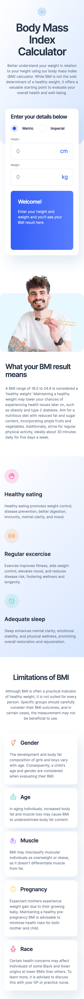
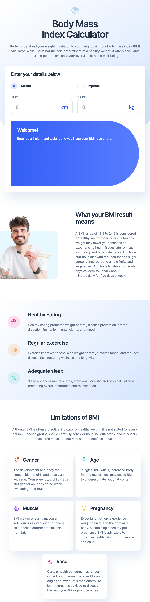
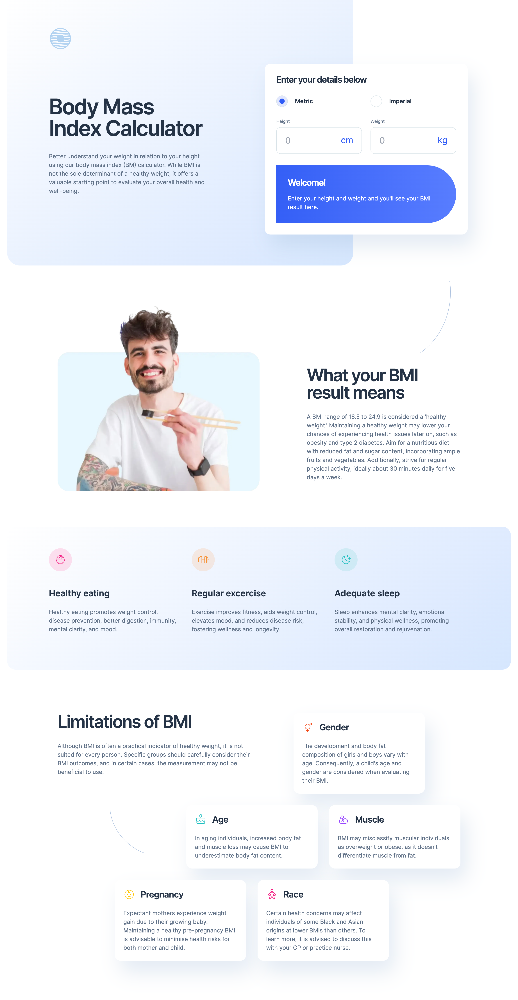

# Frontend Mentor - Body Mass Index Calculator solution

This is a solution to the [Body Mass Index Calculator challenge on Frontend Mentor](https://www.frontendmentor.io/challenges/body-mass-index-calculator-brrBkfSz1T). Frontend Mentor challenges help you improve your coding skills by building realistic projects. 

## Table of contents

- [Overview](#overview)
  - [The challenge](#the-challenge)
  - [Screenshots](#screenshots)
  - [Links](#links)
- [My process](#my-process)
  - [Built with](#built-with)
  - [What I learned](#what-i-learned)
  - [Continued development](#continued-development)
  - [Useful resources](#useful-resources)
- [Author](#author)

## Overview

### The challenge

Users should be able to:

- Select whether they want to use metric or imperial units
- Enter their height and weight
- See their BMI result, with their weight classification and healthy weight range
- View the optimal layout for the interface depending on their device's screen size
- See hover and focus states for all interactive elements on the page

### Screenshots

### Links

- Solution URL: [https://github.com/Jschles1/bmi-calculator-landing-page](https://github.com/Jschles1/bmi-calculator-landing-page)
- Live Site URL: [Add live site URL here](https://bmi-calculator-landing-page.vercel.app/)

## My process

### Built with

- Semantic HTML5 markup
- Flexbox
- Mobile-first workflow
- [React](https://reactjs.org/) - JS library
- [Next.js](https://nextjs.org/) - React framework
- [TailwindCSS](https://tailwindcss.com/) - For styles

### What I learned

This project did not really give me any new challenges that I haven't encountered before. I used this project mainly as a way to practice my skills with creating non-conventional responsive layouts.

### Continued development

I may look into using CSS grid instead of flexbox for future non-conventional responsive layouts.

### Useful resources

- [CDC](https://www.cdc.gov/nccdphp/dnpao/growthcharts/training/bmiage/page5_2.html) - Reference for calculating BMI formulas.

## Author

- Website - [John Schlesinger](https://bmi-calculator-landing-page.vercel.app/)
- Frontend Mentor - [@Jschles1](https://www.frontendmentor.io/profile/Jschles1)
